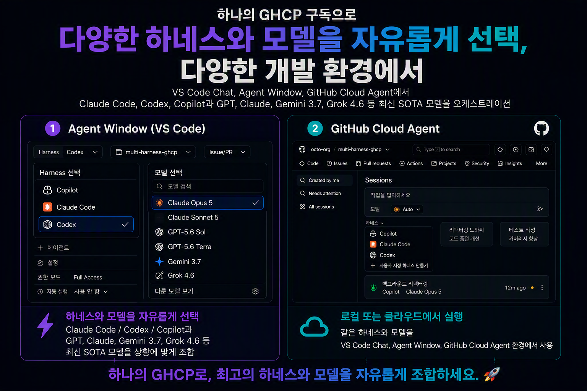
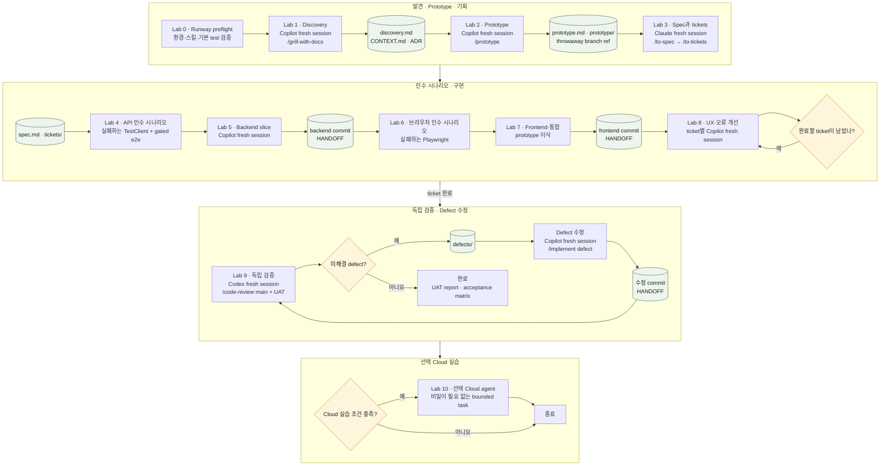

# Agentic Workflow with Multi Harness

[](https://github.com/HakjunMIN/multiharness-ghcp/actions/workflows/verify.yml)
[](https://github.com/HakjunMIN/multiharness-ghcp/blob/main/app/api/pyproject.toml)
[](https://github.com/HakjunMIN/multiharness-ghcp/blob/main/app/web/package.json)
[](https://github.com/HakjunMIN/multiharness-ghcp/blob/main/scripts/check-repo.sh)


<p align="center">
  
</p>

Mutli Harness를 이용하여 Microsoft Agent Framework backend와 React frontend로 공개 웹 근거 기반 제품 상담 app을 만드는 hands-on 과정입니다. Foundry IQ retrieval과 model endpoint는 운영자가 관리하는 APIM 뒤에 있으며, 참가자는 origin credentials를 받지 않습니다.

## 완성할 앱

모든 참가자는 다음을 포함한 제품 상담 앱 전체를 구현합니다.

- React 질문 입력과 loading/error 상태
- `POST /api/consult`를 통한 제품 상담
- 공개 웹 근거를 사용한 answer와 structured citations
- 답변과 출처를 함께 보여 주는 UI
- 근거가 없을 때 답을 꾸며내지 않는 동작

## 시작

운영자가 제공한 리포를 clone합니다. 최종 PR을 만들 때는 자신의 fork를
사용하지만 spec, ticket, defect는 모두 저장소의 local work item으로 관리하므로
remote tracker 권한과 연결은 요구하지 않습니다.

터미널 A에서 환경을 준비하고 dev server를 띄웁니다. `./scripts/dev.sh`는
종료하기 전까지 터미널을 붙잡고 있으므로 이 터미널은 그대로 둡니다.

```bash
git clone <repo-url>
cd <repo>
./scripts/preflight.sh
cp .env.example .env
./scripts/dev.sh
```

터미널 B를 새로 열어 두 server가 응답하는지 확인합니다.

```bash
curl http://127.0.0.1:8000/healthz
curl -s -o /dev/null -w '%{http_code}\n' http://127.0.0.1:5173/
```

운영자가 전달한 다섯 runtime 값은 `.env`에만 둡니다. 커밋된 예시는 non-routable입니다.

## Main flow

```text
discovery -> mandatory prototype -> spec/tickets
  -> API acceptance -> backend implementation
  -> browser acceptance -> frontend integration
  -> UX/error improvement -> independent verification
```

<details>
<summary><strong>전체 흐름 다이어그램 펼쳐보기</strong></summary>



</details>

실선으로 연결된 역할이 바뀔 때마다 **New Chat**으로 fresh session을 엽니다.
원통형 노드는 다음 세션이 이전 채팅 없이 읽는 durable artifact입니다. Lab 10은
완료 조건에 포함되지 않는 선택 경로이며, 언제든 비밀이 필요 없는 bounded
task에만 사용할 수 있습니다.

아래 runtime/model은 권장 기본값입니다. 다른 조합을 사용해도 되지만 역할별
fresh session과 durable artifact를 유지하고 실제 조합을 기록합니다.

| 역할 | 권장 agent runtime | 권장 model | 다음 역할에 남기는 것 |
| --- | --- | --- | --- |
| 발견 | Copilot fresh session | GPT-5.6 Sol | `discovery.md`, `CONTEXT.md`, ADR |
| Prototype | Copilot fresh session | GPT-5.6 Sol | `prototype.md`, `prototype/`, throwaway branch ref |
| 아키텍처, 기획 | Claude fresh session | Claude Opus 4.8 | `spec.md`, `tickets/` |
| 구현 | Copilot fresh session | GPT-5.6 Sol | 구현 commit, `HANDOFF` |
| 독립 검증 | Codex fresh session | GPT-5.6 Terra | UAT report, `defects/` |

자세한 흐름은 [에이전틱 개발 워크플로](docs/reference/workflow.md), 조합의 의미는 [모델 하네스 매트릭스](docs/reference/model-harness-matrix.md)를 봅니다.

## VS Code와 harness 사전 설정

VS Code **1.128.0 이상**의 trusted workspace를 사용합니다. Chat view 또는
Agents 창에서 **Session Target**으로 harness를 고르고, 입력창의 **language
model picker**에서 model을 별도로 고릅니다. 공식 절차는
[Agent harnesses](https://code.visualstudio.com/docs/agents/run/agent-harnesses)를
따릅니다.

- Claude는 기본 활성화되며 `github.copilot.chat.claudeAgent.enabled`로
  제어합니다. GitHub Copilot provider 또는 Anthropic 인증 경로를 수업 전에
  설정하고 billing provider를 확인합니다.
- Codex는 OpenAI Codex extension을 설치하거나
  `chat.agentHost.codexAgent.enabled`를 활성화합니다. GPT-5.6 Terra는 local
  Codex의 Copilot-backed provider에서 확인하며 GitHub 로그인과
  **Copilot Pro+**가 필요합니다.
- 독립 검증의 권장 경로는 local Codex입니다. 사용할 수 없으면 구현 세션과
  분리된 다른 verifier runtime/model을 선택하고 UAT report에 실제 조합을
  기록합니다. **Cloud Codex**도 이 조건을 충족하는 경우 대안으로 사용할 수
  있습니다.

이 과정의 에이전틱 개발 워크플로는 특정 스킬 세트에 종속되지 않습니다.
`.agents/skills/`에는 project-scope 스킬 15개가 미리 설치되어 있습니다. 외부
13개(Matt Pocock 12개와 Anthropic `frontend-design`)는 `skills-lock.json`으로
잠기고, 이 저장소가 직접 작성한 2개(`workflow`, `microsoft-agent-framework`)는
소스가 없으므로 잠금 파일에 등록하지 않습니다. 설치 계약은
`./scripts/check-repo.sh`로 확인합니다. 복원이 필요할 때만 잠금 파일에서
`npx skills experimental_install`을 실행하고, 선택 설치를 다시 만들어야 하면
Matt Pocock 스킬 12개와 `frontend-design`을 함께 지정합니다.

```bash
npx skills@latest add mattpocock/skills \
  --agent github-copilot --copy -y \
  --skill grill-with-docs grilling domain-modeling research codebase-design \
  to-spec to-tickets implement prototype tdd code-review diagnosing-bugs
npx skills@latest add anthropics/skills@frontend-design \
  --agent github-copilot --copy -y
```

spec, ticket, defect 규약은 [local work item tracker](docs/agents/issue-tracker.md)를
따릅니다. 공유 용어는 `CONTEXT.md`, 되돌리기 어려운 결정은
[`docs/adr/`](docs/adr/README.md), 기능별 진행 상태와 산출물은
[`docs/work/`](docs/work/README.md)에 기록합니다. `docs/work/`에는 현재 진행 중인
랩의 discovery와 spec 같은 산출물이 있을 수 있으며, 기능별 root 아래에 계속
누적합니다.

## 선택: `/workflow` conductor

지금 어느 단계인지, 다음에 어떤 세션을 열어야 하는지 헷갈릴 때는 이 저장소가
직접 작성한 project-scope 스킬 `/workflow`를 사용할 수 있습니다. 커밋된 durable
artifact를 읽어 현재 단계를 판정하고, 직전 단계의 exit gate를 검증하고, 다음
fresh session의 harness/model과 붙여넣을 명령을 알려 줍니다.

```text
/workflow                     현재 단계 판정과 다음 한 걸음
/workflow product-consultation  특정 feature root를 대상으로 판정
/workflow status              판정만 하고 하위 스킬은 실행하지 않음
```

`/workflow`는 **선택 경로**입니다. `/grill-with-docs`, `/prototype`,
`/to-spec`, `/to-tickets`, `/implement`, `/code-review`를 직접 실행하는 기존
흐름은 그대로 유효하며, conductor는 이 스킬들을 참조만 하고 대체하지 않습니다.
conductor도 역할별 fresh session 규칙을 우회하지 않습니다. 세션 전환은 사람이
Session Target으로 직접 합니다.

## Labs

- [Lab 0 - Runway preflight](docs/labs/lab0-preflight.md)
- [Lab 1 - Discovery](docs/labs/lab1-discovery.md)
- [Lab 2 - Prototype](docs/labs/lab2-prototype.md)
- [Lab 3 - Spec and tickets](docs/labs/lab3-spec-tickets.md)
- [Lab 4 - API acceptance scenarios](docs/labs/lab4-api-acceptance.md)
- [Lab 5 - Backend consultation slice](docs/labs/lab5-backend-slice.md)
- [Lab 6 - Browser acceptance scenarios](docs/labs/lab6-browser-acceptance.md)
- [Lab 7 - Frontend and backend integration](docs/labs/lab7-frontend-integration.md)
- [Lab 8 - Consultation UX improvement](docs/labs/lab8-improvement.md)
- [Lab 9 - Independent verification](docs/labs/lab9-verification.md)
- [Lab 10 - Cloud agent (선택)](docs/labs/lab10-cloud-agent.md)

Lab 10은 선택입니다. Copilot cloud agent와 cloud partner agent는 별도 plan과
정책이 필요하므로 조건이 갖춰진 참가자만 진행하고 Lab 0~9의 평가 경로에는
포함하지 않습니다.

## 검증

```bash
(cd app/api && uv run --frozen pytest -q)
(cd app/web && npm test && npm run build)
(cd app/web && npm run test:browser)
./scripts/check-repo.sh
```

`npm run test:browser`는 Lab 6에서 인수 시나리오를 작성한 뒤 frontend 구현
전까지 **red**가 정상입니다. runway 상태에서는 선탑재된 smoke 시나리오가
green입니다.
